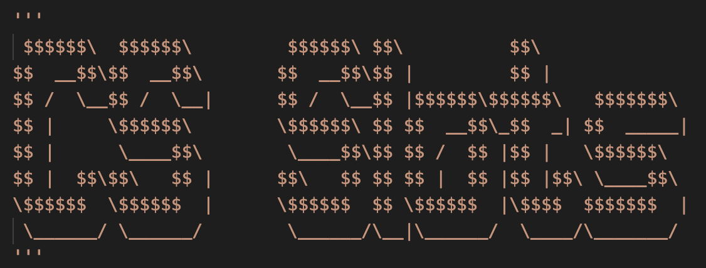

# Welcome to my Python Slots Simulator



For an online playable version, visit my [site](https://stevexero.com/projects/slots-simulator/)

or

## How to Run This Project

### Prerequisites

- Python 3.x installed on your machine
- `git` installed on your machine

1. **Clone the Repository**:

   ```bash
   git clone https://github.com/stevexero/slots_simulator.git
   ```

2. **Navigate to the Project Directory**:

   ```bash
   cd slots_simulator
   ```

3. **Create and Activate a Virtual Environment** (optional but recommended):

   - Create a virtual environment:
     ```bash
     python -m venv venv
     ```
   - Activate the virtual environment:
     - On Windows:
       ```bash
       .\venv\Scripts\activate
       ```
     - On macOS and Linux:
       ```bash
       source venv/bin/activate
       ```

4. **Run the Program**:
   ```bash
   python main.py
   ```

#### Additional Information

If you encounter any issues or have questions, please open an issue in this repository.

## About this project

This project is a culmination of all of the concepts learned in CIT 129, Introduction to Programming. These concepts included data types, loop types, arrays, functions, pseudocode, flowcharting, and an introduction to Python.
